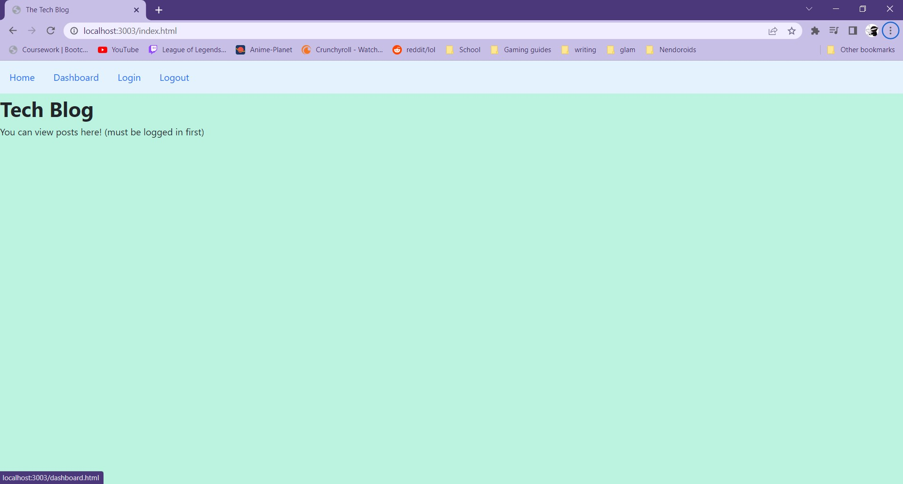

# Tech Blog
  
  
  ***
  ## Table of Contents
  - [Description](#description)
  - [Visual Presentation](#visual-presentation)
  - [Technologies Used](#technologies-used)
  - [Installation](#installation)
  - [Usage](#usage)
  - [Contribution](#contribution)
  - [Testing](#testing)
  - [Additional Info](#additional-info)
  ***
  ## Description
  An Applications that allows you to register users. When you are registered you are then able to post blogs. People may comment on them and you can delete them. People are able to view from the homepage.
  ***
  ## Technologies Used
  Bcrypt, Dotenv, Express, Mysql12, Sequelize
  ***
  ## Visual Presentation
  
  ***
  ## Installation
  Heroku is down so there is no deployable
  ***
  ## Usage
  To create and share blogs with other users
  ***
  ## Contribution
  N/a
  ***
  ## Testing
  N/a
  ***
  ## Additional Info
  - Executable: N/a heroku down
  - Github: Ahrionic(https://github.com/Ahrionic)
  - Email: koreyluu@gmail.com
